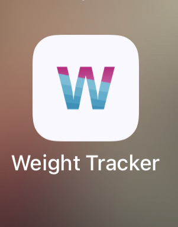
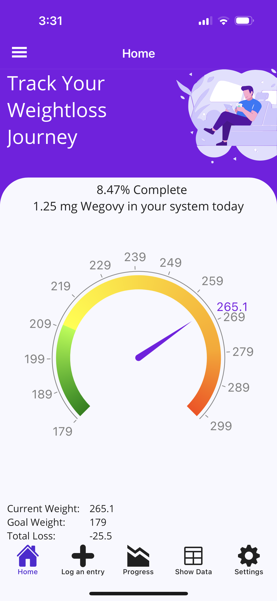
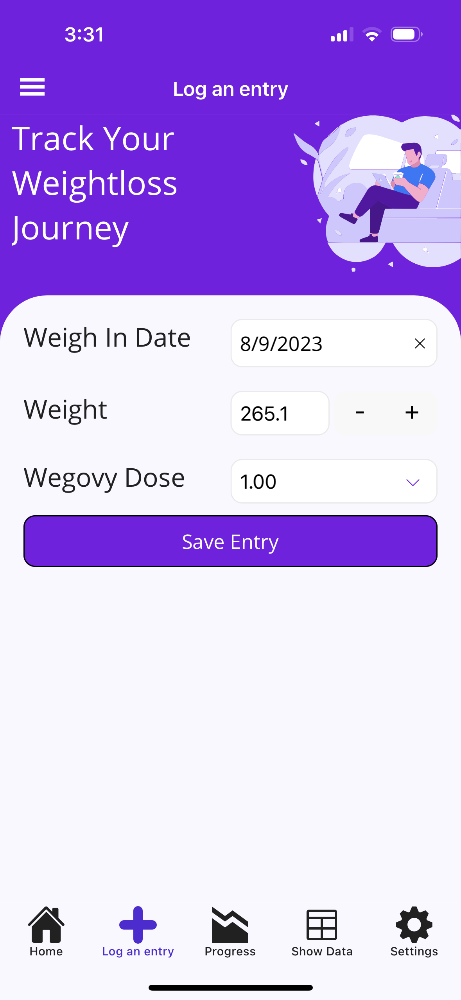
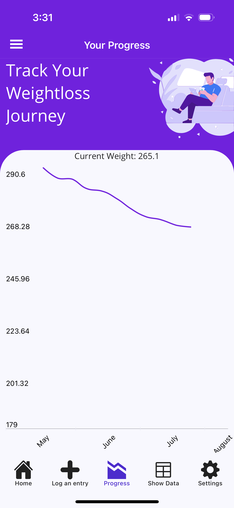
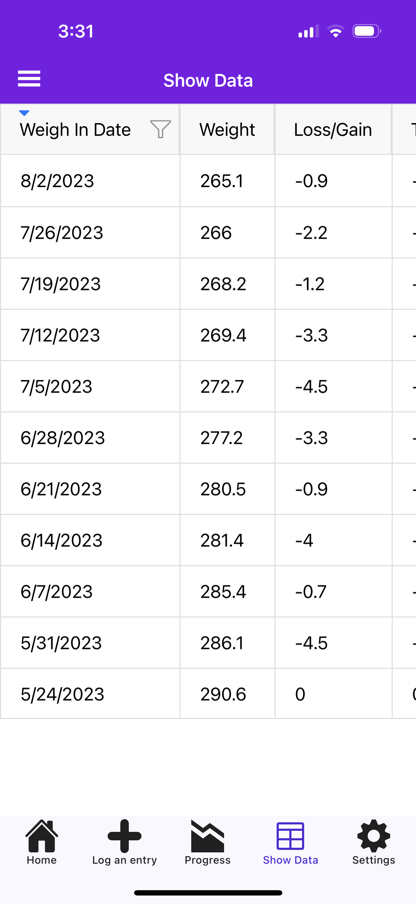
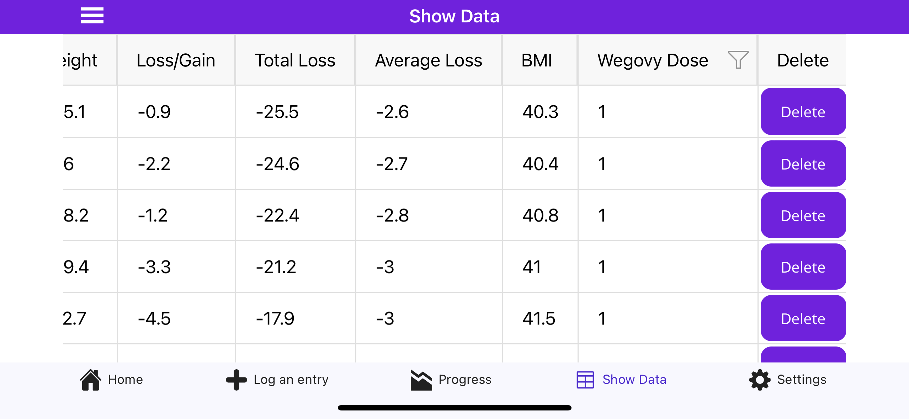
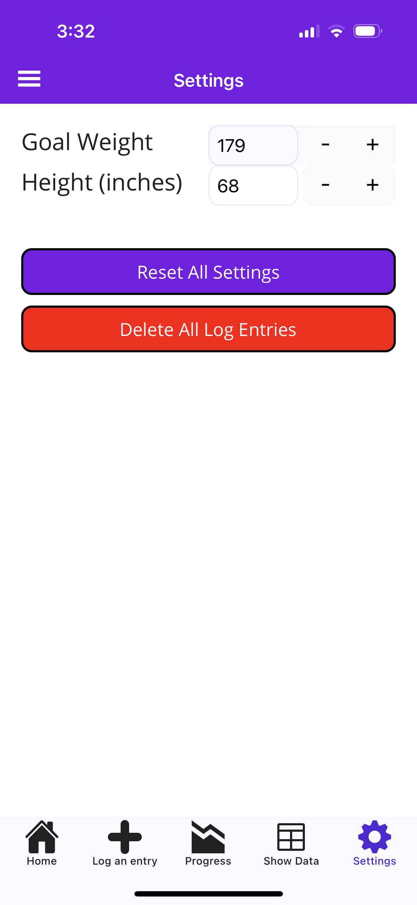

# Wegovy Weight Loss Tracker App

This repository contains information about my personal Wegovy Weight Loss Tracker App.

**NOTE - I am NOT affiliated with Novo nordisk, I am just a happy user of the product. I created this app for myself and am sharing it with the community for you to track your journey too!**

## Getting Started

When you first launch the application, you need to enter your goal weight and your height (in inches) in the settings page. 

Your next step is that you will need to do an initial Log Entry so that your starting weight is captured.

After this feel free to log any entries. The app is setup to show you 7 days inbetween each entry by default. Your best bet is to only log once every 7 days, but it is perfectly acceptable to do as many as you want.

## Screenshots

Here are some screenshots of the application in action:

### Application Icon

### Splash Screen

### Home Screen

### Log Entry Screen

### Progress Screen

### Show Data Screen
#### Vertical View

#### Horizontal View

### Settings Screen

## Known Issues

1. Data can't be edited. You can delete an entry and then re-create it.
2. When logging an entry you can't specify a date earlier than the last entry date. This will be fixed in an upcoming version.

