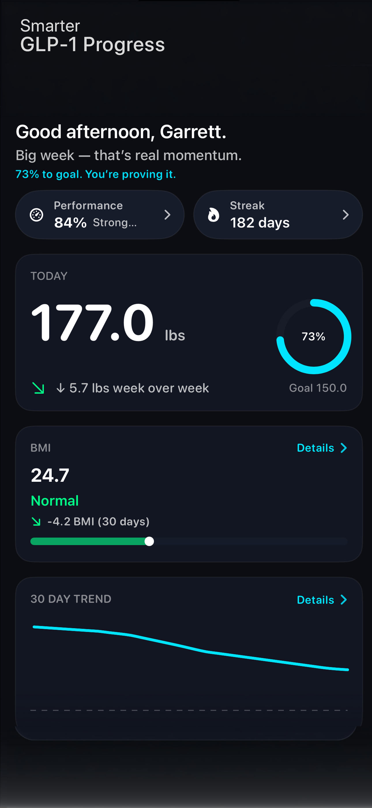
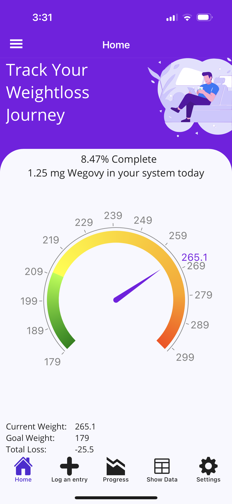
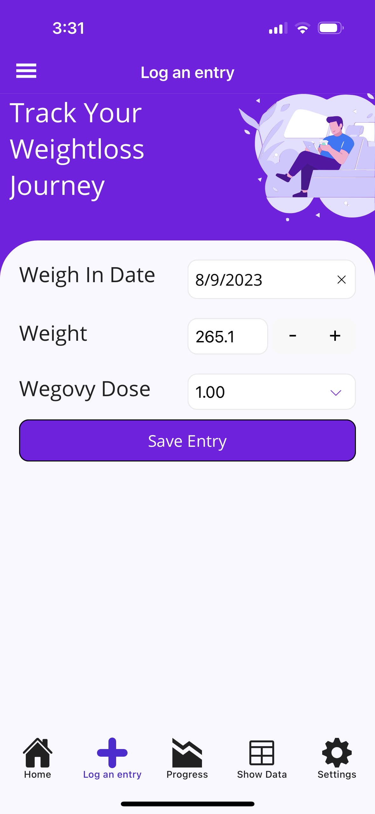
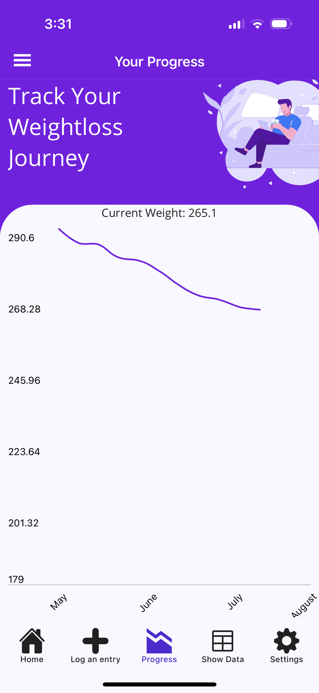
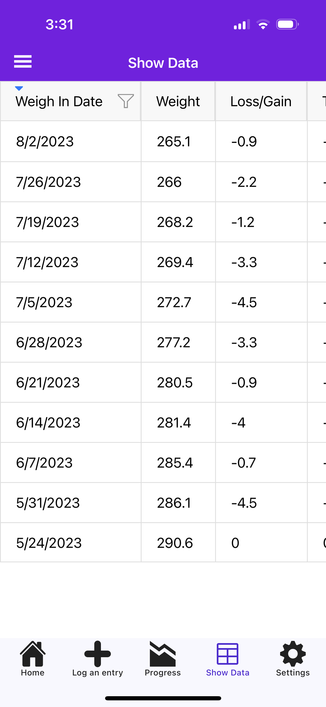
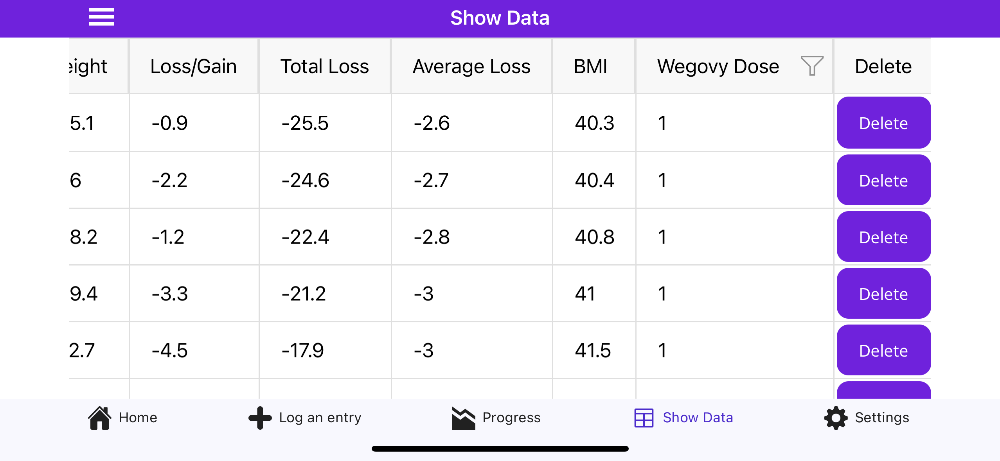
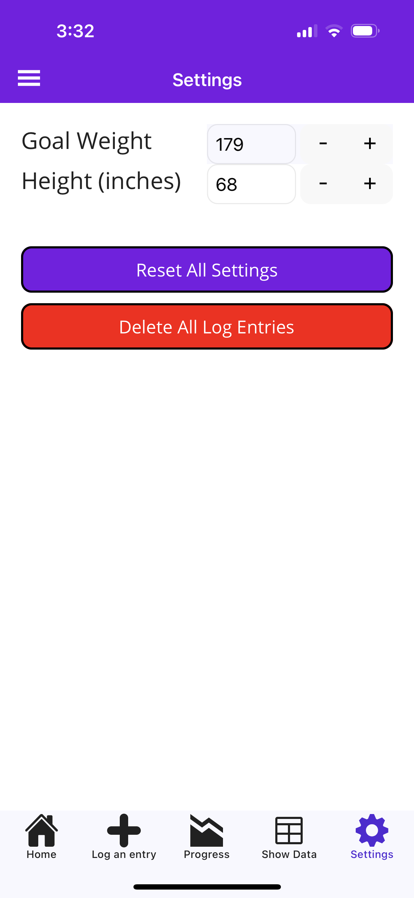

# Weight Loss Tracker (WeLose)

Smarter GLP-1 Progress Tracking Companion.

If you are on a GLP-1 medication, consistency matters.

This app is built to help you stay accountable and see real progress clearly.

- Track your weight  
- Log injections  
- Understand your weekly momentum  
- Know what is working  

No noise. No gimmicks. Just clarity.

---

## See the Pattern in Your Progress

- Interactive weight trends  
- 7, 30, and 90-day views  
- Weekly change tracking  
- Clear progress to goal  

Small changes add up. This helps you see them.

---

## Stay Consistent

- Log dose and injection site  
- Track your schedule  
- Maintain protocol history  
- Monitor streaks and milestones  

Because showing up week after week is what drives results.

---

## Know What Is Working

Break your progress down into:

- Total loss  
- Weekly averages  
- Best and strongest weeks  
- Distance to goal  

When you can see what is working, it is easier to keep going.

---

## Units Supported

- Pounds (lbs)
- Kilograms (kg)

---

## Support

Need help, have feedback, or hit a bug?

Email: **appsupport@itrolling.com**

---

## App Store

Download on iOS:
https://apps.apple.com/us/app/wegovy-weight-loss-tracker/id6458646995

---

## Privacy

See: [PrivacyPolicy.md](./PrivacyPolicy.md)

---

## Disclaimer

I am **not affiliated with Novo Nordisk or any other GLP-1 manufacturer**. This is an independent app created to help track a GLP-1 journey.

## Screenshots

Here are some screenshots of the application in action:

### Dashboard

### Splash Screen

### Home Screen

### Log Entry Screen

### Progress Screen

### Show Data Screen
#### Vertical View

#### Horizontal View

### Settings Screen

## Known Issues

None at this time

